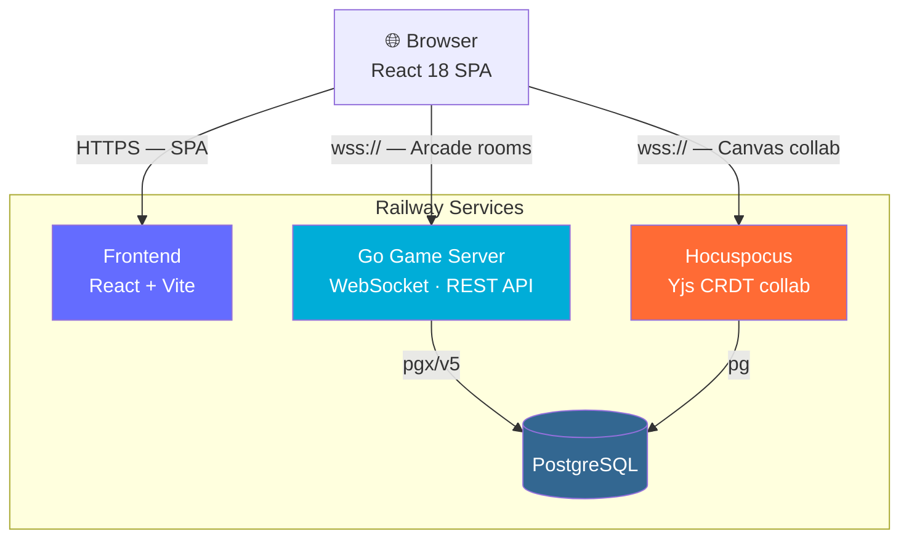
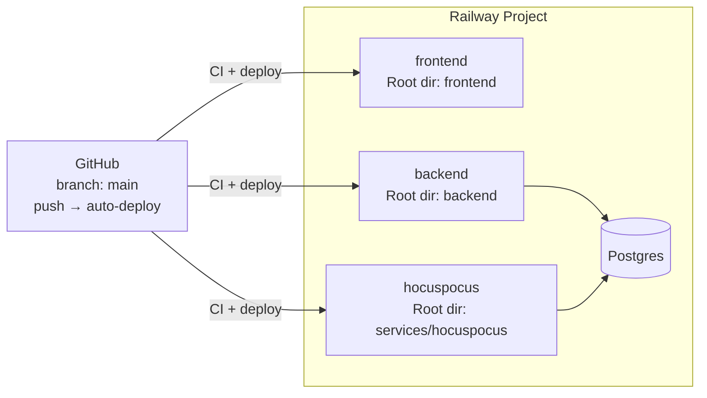

# Algo Moves

**Learn algorithms the way AI learns — watch, predict, get feedback, repeat.**

> *How does a model get good? It tries, gets a signal, adjusts, and tries again.* Algo Moves applies that same loop to algorithm mastery.

Visual interview prep — step through algorithms like a chess transcript: watch the move, predict the next one, rebuild the code, and repeat until the pattern sticks. Algo Moves is a plugin-driven learning environment: the shell is algorithm-agnostic, every problem is a self-contained plugin, and the engine replays every pointer move, push/pop, and state change as a first-class **move transcript** you can scrub, drill, and share.

~**400 problems** · real-time multiplayer arcade · collaborative canvas · interview facilitation · mobile swipe deck · Vim Dojo

[](LICENSE)
[](https://react.dev/)
[](https://www.typescriptlang.org/)
[](https://go.dev/)
[](https://vitejs.dev/)
[](https://railway.com)

```bash
make install && make dev   # → http://localhost:4321
```

---

## Contents

| | |
|---|---|
| [The Learning Loop](#the-learning-loop) | How mastery works |
| [Features](#features) | All modes at a glance |
| [Problem Library](#problem-library) | 400 problems across three layers |
| [Technology Stack](#technology-stack) | React · Go · Postgres · Hocuspocus |
| [Architecture](#architecture) | System overview + links to deep-dive docs |
| [Quick Start](#quick-start) | Install · dev · build · test |
| [Deployment](#deploying-to-railway) | Railway 4-service deploy |
| [Plugin System](#plugin-system) | How to add a problem |
| [Scripts Reference](#scripts-reference) | All npm scripts |
| [Folder Map](#folder-map) | Directory layout |
| [Documentation](#documentation) | All docs |

---

## The Learning Loop

How does a model get good? It tries, gets a signal, adjusts, and tries again — structured repetition with honest feedback. Algo Moves applies the same loop to human study:

```
  Watch ──▶ Quiz ──▶ Miss? ──▶ Restart from Q1
              │                    (score resets, choices shuffle)
              ▼
           3-streak ──▶ 🏆 Mastered
```

1. **Watch** the algorithm step-by-step on a live canvas.
2. **Quiz** yourself — predict the next move, the complexity, the key line.
3. **Miss?** The run restarts from question 1. You don't skip the gap; you run the pattern again until recall is automatic.
4. **Master** — three correct answers in a row marks a problem mastered.

On desktop, **Code Studio** runs the same ladder as a gated phase: quiz → reassemble → blind recall. On your phone, **Swipe mode** runs animate → quiz → rebuild in a full-screen deck.

> Most visualizers show you the *answer*. Algo Moves shows you the **process** — every pointer move, every state change — as a replay transcript you can share, scrub, and drill.

---

## Features

| Mode | What you get |
|------|-------------|
| **Visualize** | Step player · move log · inspector · shareable replay URLs — replay on graphs, grids, arrays, trees |
| **Learn** | Cases · quiz · simulate-next-move · Code Studio (quiz → reassemble → blind recall) |
| **Practice** | Wrong answer → full restart · shuffled choices · 3-streak mastery |
| **Mobile deck** | Full-screen swipe deck for drilling a topic on the go (`#mobile`) |
| **Vim Dojo** | Keyboard-only maze puzzles that teach Vim motions (`#vim`) |
| **Dojo** | 12 algorithm pattern modules for blind practice (`#dojo`) |
| **Games Arcade** | Real-time two-player games — Would You Rather, Number Duel, RPS, Tic-Tac-Toe, Mind Meld, Reaction Duel (`#games`) |
| **Canvas** | Freeform React Flow workspace with collaborative editing |
| **Interview** | Host + candidate on a shared problem with shared timer, lock, and viewport follow |
| **Home** | Course catalog with progress meters, difficulty breakdown, and resume-last |

---

## Problem Library

~**400 problems** across three layers:

| Layer | Count | Location | Simulators |
|-------|-------|----------|------------|
| **Prep library** | 271 | `frontend/src/plugins/imported/prepManifest.ts` *(generated)* | 271/271 bespoke step-simulators in `prepSimulators/problems/` |
| **Progress library** | 91 | `frontend/src/plugins/imported/manifest.ts` *(generated)* | Hand-built simulators in `simulators/problems/` |
| **Curated plugins** | 18 | Hand-authored in `frontend/src/plugins/<id>/` | Native `record()` + `View` |

Problems draw from [LeetCode](https://leetcode.com/), [HackerRank](https://www.hackerrank.com/), and original teaching exercises. Solutions, simulators, quizzes, and visualizations are original implementations — study aids, not copies of platform editorials. Full attribution: [`ATTRIBUTIONS.md`](ATTRIBUTIONS.md).

> **Generated manifests are downstream artifacts.** Run the generator (`import-problems.mjs` / `import-prep.mjs`), then regenerate — never hand-edit `manifest.ts`, `prepManifest.ts`, or any file in `_generated/`.

---

## Technology Stack

| Category | Technology |
|----------|-----------|
| **SPA** | React 18 · TypeScript 5 · Vite 8 |
| **Styling** | Tailwind CSS 3 · PostCSS · design token system (`design/tokens.ts`) |
| **Components** | Radix UI · Lucide icons · `clsx` + `tailwind-merge` · CVA |
| **Code editing** | CodeMirror 6 · `@replit/codemirror-vim` · One Dark · Go/Python/JS langs |
| **Graph canvas** | `@xyflow/react` 12 · `@dagrejs/dagre` · elkjs |
| **Collaboration** | `@hocuspocus/provider` · Yjs |
| **State** | Zustand |
| **Flashcard engine** | `ts-fsrs` (FSRS spaced repetition) |
| **Backend** | Go 1.25 · stdlib WebSocket · `pgx/v5` · `alexedwards/scs` |
| **Database** | PostgreSQL 16 · sqlc · 16 migrations |
| **Realtime collab** | Hocuspocus (Node.js · `@hocuspocus/server` 3.4) |
| **Deploy** | Railway (4 services: frontend, backend, hocuspocus, Postgres) |
| **Testing** | Vitest 4 · Go `testing` |
| **Quality** | ESLint 9 · `eslint-plugin-boundaries` · Husky · lint-staged · knip · madge |

---

## Architecture

Four deployed services — a React SPA, a Go game server, Hocuspocus (Yjs CRDT), and Postgres.



**Deep-dive architecture docs:**

| Doc | What's inside |
|-----|--------------|
| [**Frontend Architecture**](docs/ARCHITECTURE-FRONTEND.md) | Layer dependency graph · route map · plugin system · state management · data flow · design tokens · generated artifacts pipeline · quality guardrails |
| [**Backend Architecture**](docs/ARCHITECTURE-BACKEND.md) | Go workspace · module dependency graph · HTTP surface · WebSocket protocol · room lifecycle · domain packages · database schema · deployment diagrams |
| [**Architecture Overview**](docs/architecture.md) | Combined session model (solo / collab / interview) · Postgres stores · shell/canvas/plugin/games boundaries |

---

## Quick Start

```bash
# 1. Install all dependencies (frontend + backend Go deps)
make install

# 2. Start frontend dev server
make dev                   # → http://localhost:4321

# 3. (Optional) Start the backend — only needed for multiplayer Games arcade
make backend-dev           # → :8080

# 4. (Optional) Full stack with Hocuspocus canvas collab
make dev-all               # frontend + backend + hocuspocus
```

### Other common commands

```bash
# Typecheck
make typecheck             # tsc --noEmit

# Production build
make build

# Frontend tests
cd frontend && npm test

# All quality checks (CI gate)
cd frontend && npm run check:all   # boundaries · circular · typography · tokens · quiz labels · simulators

# Backend tests (per Go module)
cd backend
for m in . realtime shared; do (cd "$m" && go test ./...); done

# Backend build
cd backend && go build ./cmd/gameserver
```

### LAN / Multi-Device Play

Run `make dev` + `make backend-dev`. Open the frontend on your laptop's LAN IP from other phones/tablets — the client auto-connects to `ws://<that-host>:8080`.

---

## Deploying to Railway

Deploy all four services on [Railway](https://railway.com). Pushes to **`main`** auto-deploy via Railway's GitHub integration.



**Setup steps:**

1. Create a Railway project with four resources: **frontend**, **backend**, **hocuspocus**, **Postgres**.
2. Connect GitHub for each service (Settings → Source → Root Directory → branch `main` → Deploy on push).
3. Generate public domains for frontend, backend, and hocuspocus (Settings → Networking).
4. Set service variables:

   | Service | Variable | Value |
   |---------|----------|-------|
   | `backend` | `ALLOWED_ORIGINS` | `https://${{frontend.RAILWAY_PUBLIC_DOMAIN}}` |
   | `backend` | `DATABASE_URL` | `${{Postgres.DATABASE_URL}}` |
   | `backend` | `RUN_MIGRATIONS` | `true` |
   | `backend` | `RUN_CONTENT_SEED` | `true` |
   | `hocuspocus` | `DATABASE_URL` | `${{Postgres.DATABASE_URL}}` |
   | `hocuspocus` | `HOCUSPOCUS_ALLOWED_ORIGINS` | `https://${{frontend.RAILWAY_PUBLIC_DOMAIN}}` |
   | `frontend` | `VITE_API_SERVER_URL` | `https://${{backend.RAILWAY_PUBLIC_DOMAIN}}` |
   | `frontend` | `VITE_HOCUSPOCUS_URL` | `wss://${{hocuspocus.RAILWAY_PUBLIC_DOMAIN}}` |

5. Deploy (Railway CLI):

   ```bash
   railway up . --service backend --detach
   railway up . --service frontend --detach
   railway up services/hocuspocus --path-as-root --service hocuspocus --detach
   ```

   Or run the deploy script: `./scripts/railway-deploy.sh`

See [Backend Architecture → Deployment](docs/ARCHITECTURE-BACKEND.md#deployment) for Docker and env var details.

---

## Plugin System

The engine is **completely algorithm-agnostic** — it steps an array of `Frame`s and asks the plugin's `View` to render the current one.

```
                ┌─────────────────────────────────┐
  core/         │ types.ts   ProblemPlugin contract │
  (engine,      │ registry.ts  lazy loading         │
   contracts)   │ usePlayer.ts  step/play/reset      │
                └─────────────────────────────────┘
                       ▲                    ▲
                       │ implements         │ renders
  plugins/<name>/ ─────┘                   │
    index.tsx    meta + inputs + record + View
    recorder.ts  algorithm → Frame[]       │
    <Name>View   draws one frame ──────────┘ via shared components/
```

A plugin satisfies `ProblemPlugin<Input, State>`:

| Field | Responsibility |
|-------|----------------|
| `meta` | id · title · difficulty · tags · source · summary |
| `inputs` | named sample inputs for the input dropdown |
| `record` | run the algorithm, `emit` one `Frame` per move |
| `View` | render a single frame's state (uses `components/` and `_shared/vizKit`) |
| `verdict` | optional — derive pass/fail from final frames |
| `code` / `quiz` / `codePieces` | optional — Code Studio and Learn-mode panels |

### Add a new plugin

```bash
# Scaffold a native plugin
npm run new-problem -- two-sum "Two Sum"
# → creates frontend/src/plugins/two-sum/{index.tsx,recorder.ts,cases.ts,practice.ts}

# Then register it:
# 1. Append to curatedPlugins in frontend/src/plugins/index.ts
# 2. Add { id, kind, pluginId } in frontend/src/content/courses.ts
# 3. npm run build-plugin-meta

# Or scaffold a prep simulator
npm run scaffold-prep-sim -- lru-cache
```

See [Plugin Authoring](frontend/src/plugins/README.md) · [Worked Example](frontend/src/plugins/EXAMPLE.md) · [Frontend Architecture → Plugin System](docs/ARCHITECTURE-FRONTEND.md#plugin-system).

---

## Scripts Reference

Run from `frontend/` (or via `make` for common targets):

### Development

| Script | Purpose |
|--------|---------|
| `dev` | Vite dev server → `http://localhost:4321` |
| `build` | Typecheck + production bundle |
| `preview` | Preview production build |
| `typecheck` | `tsc --noEmit` |
| `test` | Vitest + orphan plugin check |

### Quality Checks

| Script | Purpose |
|--------|---------|
| `check:all` | All guards: boundaries · circular · orphans · typography · tokens · quiz labels · simulators · lighthouse · plugin meta |
| `check:quiz-labels` | Quiz choice format + integrity label tests |
| `check-plugin-typography` | Lint plugin UI for hardcoded font sizes |
| `check-shell-typography` | Ban hardcoded px font sizes in shell |
| `check:tokens` | Design-token guard |
| `check:lighthouse-budget` | Static HTML · PWA · a11y budget guard |
| `check-simulators` | Progress-library simulator integrity |
| `check-prep-sim-coverage` | Fail if any prep id lacks a simulator |
| `check-mobile-decks` | Validate mobile deck coverage |

### Content Pipeline

| Script | Purpose |
|--------|---------|
| `import-prep` | Regenerate `prepManifest.ts` (271 prep problems) |
| `import-problems` | Regenerate progress `manifest.ts` (91 problems) |
| `build-plugin-meta` | Regenerate lightweight plugin + course metadata |
| `build-problem-briefs` | Regenerate problem statements and examples |
| `export-content-sql` | Regenerate Postgres content seed SQL |
| `generate-themes` | Regenerate theme CSS from token source |

### Authoring / Scaffolding

| Script | Purpose |
|--------|---------|
| `new-problem -- <slug> "<Title>"` | Scaffold a native plugin |
| `new-effect -- <slug>` | Scaffold a canvas effect plugin |
| `scaffold-prep-sim -- <slug>` | Stub a new prep simulator |
| `draft-quiz-from-frames -- <id>` | Draft quiz choices from recorder captions |

---

## Folder Map

```
algo-moves/
├── Makefile                     wraps frontend + backend + db targets
├── docker-compose.yml           local full-stack
├── CHANGELOG.md
├── ATTRIBUTIONS.md              LeetCode / HackerRank / OSS notices
│
├── frontend/                    React + Vite SPA
│   ├── index.html
│   ├── package.json · vite.config.ts · tsconfig*.json
│   ├── scripts/                 25+ build · check · import scripts
│   └── src/
│       ├── main.tsx             app entry
│       ├── App.tsx              route switch (useWorkspace().route)
│       ├── core/                ProblemPlugin contract · usePlayer · registry
│       ├── design/              token system (tokens.ts → theme.css)
│       ├── lib/                 session · quiz · canvas · utils
│       ├── platform/api/        typed REST clients for all backend domains
│       ├── content/             course catalog + _generated/problemBriefs.ts
│       ├── components/          GraphBoard · CodeMirror · puzzle · ui
│       ├── store/               Zustand slices (workspace · replay · canvas · games · …)
│       ├── effects/             canvas animation effect plugins
│       ├── hooks/               app-wide React hooks
│       ├── plugins/
│       │   ├── index.ts         plugin manifest
│       │   ├── _shared/         vizKit · pluginKit · recorders
│       │   ├── _generated/      ⚠️ pluginMeta.ts · courses.ts (generated)
│       │   ├── binary-search/   ) 18 curated native plugins
│       │   └── imported/        ) generated reference libraries
│       │       ├── manifest.ts          ⚠️ 91 progress problems (generated)
│       │       ├── prepManifest.ts      ⚠️ 271 prep problems (generated)
│       │       ├── simulators/          hand-built progress simulators
│       │       └── prepSimulators/      bespoke prep step-simulators
│       ├── shell/               all routes + app chrome
│       │   ├── home/            course catalog · landing
│       │   ├── workspace/       algorithm workspace mode router
│       │   ├── study/           Learn Studio · Play · Code Studio
│       │   ├── canvas/          React Flow workspace
│       │   ├── collab/          Yjs + relay collaboration transport
│       │   ├── interview/       interview facilitation UI
│       │   ├── panels/          shared panel bodies
│       │   ├── realtime/        WebSocket room transport
│       │   ├── mobile/          swipe deck (animate → quiz → rebuild)
│       │   ├── vim/             Vim Dojo maze puzzles
│       │   ├── dojo/            12 algo pattern practice modules
│       │   ├── games/           multiplayer arcade (6 games)
│       │   ├── plans/           study prep plans
│       │   ├── resumes/         resume workspace + OpenAI
│       │   └── profile/         user profile
│       └── styles/
│           └── theme.css        CSS custom properties · light + dark
│
├── backend/                     Go realtime game server + REST API
│   ├── go.work · go.mod         Go 1.25 workspace (3 modules)
│   ├── Dockerfile · railway.toml
│   ├── cmd/gameserver/          entrypoint
│   ├── internal/                auth · profile · games · interview · canvas · prep · resume · database · transport · config
│   ├── realtime/                hub (room engine) · ws (RFC 6455 framing)
│   └── shared/                  crypto · httputil · config helpers
│
├── db/                          PostgreSQL schema
│   ├── migrations/              001–016 canonical migration files
│   ├── content_seed.sql         ⚠️ generated learning catalog seed
│   └── seed.sql                 achievement seed
│
├── services/
│   └── hocuspocus/              Yjs CRDT collaborative canvas service
│       └── package.json         @hocuspocus/server 3.4 · pg 8
│
├── docs/                        all documentation
│   ├── ARCHITECTURE-FRONTEND.md ← frontend deep dive (new)
│   ├── ARCHITECTURE-BACKEND.md  ← backend deep dive (new)
│   ├── architecture.md          combined overview
│   ├── quiz-and-code-studio.md
│   ├── visual-qa-checklist.md
│   ├── backlog.md
│   └── roadmap/                 01–09 execution waves
│
└── scripts/                     migrate-db.sh · railway-deploy.sh
```

---

## Documentation

| Guide | Description |
|-------|-------------|
| [**Frontend Architecture**](docs/ARCHITECTURE-FRONTEND.md) | Layer graph · route map · plugin system · state management · design tokens · generated artifacts |
| [**Backend Architecture**](docs/ARCHITECTURE-BACKEND.md) | Go workspace · WebSocket protocol · room lifecycle · domain packages · database schema · deployment |
| [**Architecture Overview**](docs/architecture.md) | Combined session model · Postgres stores · shell/canvas/plugin/games boundaries |
| [**Plugin Authoring**](frontend/src/plugins/README.md) | `ProblemPlugin` contract · vizKit · teaching stack · quality gates |
| [**Plugin Example**](frontend/src/plugins/EXAMPLE.md) | Native + imported plugin end-to-end walkthrough |
| [**Quiz & Code Studio**](docs/quiz-and-code-studio.md) | Choice label format · shuffle/restart · Code Studio phases |
| [**Design Tokens**](frontend/src/design/README.md) | Typography and layout token hierarchy · three token layers |
| [**Database / Migrations**](db/README.md) | 16 migrations · Railway Postgres setup · dual canvas path |
| [**Games Arcade**](frontend/src/shell/games/README.md) | Multiplayer game layout · game contract · adding a game |
| [**Visual QA Checklist**](docs/visual-qa-checklist.md) | Release checklist for density, themes, mobile, presentation |
| [**Backlog**](docs/backlog.md) | Future ideas — not yet built |
| [**Attributions**](ATTRIBUTIONS.md) | LeetCode, HackerRank, and third-party notices |

---

## License

Copyright © 2026 Ahmed Samir · [GNU Affero General Public License v3.0](LICENSE)
