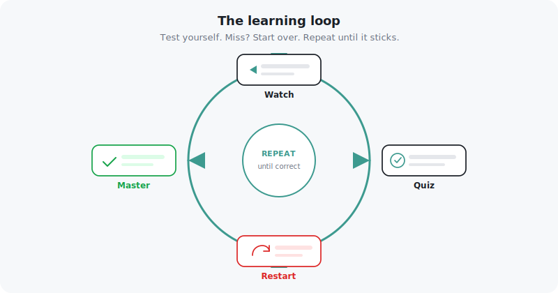
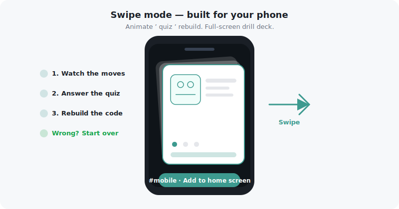

# Algo Moves

**Live demo:** deploy frontend + backend on [Railway](#deploying-to-railway) (no GitHub Pages).

**Step through algorithms like a chess transcript.**

*Learn the way AI learns — test yourself, get feedback, repeat until it sticks.*

Plugin-driven visual learning environment for coding interview prep. Each problem replays as a sequence of **moves** — state snapshots with captions — that you can scrub, play, and study. The shell (canvas, player, move log, Code Studio, mobile deck) knows nothing about any specific algorithm; every problem is a self-contained **plugin**.

~400 problems from [LeetCode](https://leetcode.com/), [HackerRank](https://www.hackerrank.com/), and original exercises — each replayed as a scrubbable sequence of **moves** with Code Studio, quizzes, and a mobile drill deck.

[](LICENSE)
[](https://react.dev/)
[](https://www.typescriptlang.org/)
[](https://vitejs.dev/)

```bash
make install && make dev   # → http://localhost:4321
```

**Contents:** [Learn the way AI learns](#learn-the-way-ai-learns) · [Features](#features) · [Problem library](#problem-library) · [Stack](#technology-stack) · [Quick start](#quick-start) · [Scripts](#npm-scripts) · [Architecture](#plugin-architecture) · [New plugin](#add-a-new-problem-plugin) · [Folder map](#folder-map) · [Docs](#documentation)

---

## Learn the way AI learns

How does a model get good? It tries, gets a signal, adjusts, and tries again. Reinforcement learning is not magic — it is **structured repetition with honest feedback**.

Algo Moves applies the same loop to human study:

1. **Watch** the algorithm move by move on a live canvas.
2. **Quiz** yourself — predict the next step, the complexity, the key line.
3. **Miss?** The run **restarts from question 1** — score resets, choices shuffle. You do not skip past the gap; you run the pattern again until it lands.
4. **Master** it — three correct answers in a row marks a problem mastered.

That is not punishment. It is how memory forms: testing your brain over and over, learning from each mistake, and rebuilding the path until recall is automatic. On desktop, **Code Studio** walks the same ladder — quiz → reassemble → blind recall. On your phone, **Swipe mode** runs animate → quiz → rebuild in a full-screen deck.

Most visualizers show you the *answer*. Algo Moves shows you the **process** — every pointer move, every push/pop, every relaxation — as a first-class move transcript you can replay, share, and drill.



> **Built into the product:** wrong quiz answers trigger an automatic full restart (~1.9 s feedback, then back to Q1 with reshuffled choices). Mastery unlocks at a **3-streak**. See [Quiz & Code Studio](docs/quiz-and-code-studio.md) for the full rules.

## Features

Every problem is a **move transcript** you can scrub, replay, and drill:

| Mode | What you get |
|------|--------------|
| **Visualize** | Step player, move log, inspector, shareable replay URLs — replay algorithms on graphs, grids, arrays, and trees |
| **Learn** | Cases · quiz · simulate-next-move · Code Studio (quiz → reassemble → blind recall) |
| **Practice** | Wrong answer → full restart · shuffled choices · 3-streak mastery |
| **Mobile deck** | Full-screen swipe deck for drilling a topic on the go (`#mobile`) |
| **Vim Dojo** | Keyboard-only maze puzzles that teach Vim motions (`#vim`) |
| **Games** | Real-time two-player games — Number Duel, RPS, Tic-Tac-Toe, Mind Meld, Reaction Duel (`#games`) |
| **Home** | Course catalog with progress meters, difficulty breakdown, and resume-last |



Built with React 18 · TypeScript 5 · Vite 5 · Tailwind · Radix UI · CodeMirror 6 · React Flow.

---

## Problem library

~**400 problems** across three layers:

| Layer | Count | Location | Simulators |
|-------|-------|----------|------------|
| **Prep library** | 271 | `frontend/src/plugins/imported/prepManifest.ts` | 271/271 bespoke step-sims in `prepSimulators/problems/` |
| **Progress library** | 91 | `frontend/src/plugins/imported/manifest.ts` | Hand-built sims in `simulators/problems/` |
| **Curated plugins** | 18 | Hand-authored (`binary-search`, six sorts, `n-queens`, `tree-traversals`, …) | Native `record()` + `View` in `frontend/src/plugins/<id>/` |

Prep imports without a simulator yet fall back to the animated **Scene** view (`prepScene.tsx`).

---

## References & attribution

Problems draw from industry interview platforms and original teaching exercises. **Solutions, simulators, quizzes, and visualizations in this repo are original implementations** — they are study aids, not copies of platform editorials.

### External problem sources

| Platform | Examples in this repo | In-app link |
|----------|----------------------|-------------|
| [**LeetCode**](https://leetcode.com/) | Two Sum, LRU Cache, Word Search, Alien Dictionary, Clone Graph, … (~100 in the progress library) | **Open on LeetCode ↗** on imported problem cards |
| [**HackerRank**](https://www.hackerrank.com/) | BFS Shortest Reach, Floyd: City of Blinding Lights, Merging Communities, Subset Component, Array Manipulation | Tagged `(HackerRank)` in titles |
| **Educational** | Unweighted shortest path, graph traversal, topological sort, reachability — pattern-first scaffolding | Marked `Educational` in manifests |

Each plugin's `meta.source` records the canonical reference. When a LeetCode URL exists, the imported factory surfaces it directly:

```124:126:frontend/src/plugins/imported/factory.tsx
      {p.leetcode && (
        <a href={p.leetcode} target="_blank" rel="noreferrer" className={cn('nodrag mt-auto inline-flex items-center gap-1 self-start text-accent hover:underline', vizText.base)}>
          Open on LeetCode ↗
```

> **Trademarks:** LeetCode is a trademark of LeetCode, LLC. HackerRank is a trademark of HackerRank, Inc. This project is not affiliated with, endorsed by, or sponsored by either platform. Full notice: [`ATTRIBUTIONS.md`](ATTRIBUTIONS.md).

---

## Technology stack

Built as a modern React SPA with a strict plugin contract and a token-driven design system.

| Category | Libraries |
|----------|-----------|
| **Core** | React 18, TypeScript 5, Vite 5 |
| **Styling** | Tailwind CSS 3, PostCSS — design tokens in `frontend/src/design/tokens.ts` and `frontend/src/styles/theme.css` |
| **Components** | Radix UI (accordion, switch), Lucide icons, `clsx` + `tailwind-merge` |
| **Code editing** | CodeMirror 6 (+ `@replit/codemirror-vim`), autocomplete, One Dark theme |
| **Graph canvas** | `@xyflow/react`, `@dagrejs/dagre` for layout |
| **Utilities** | `html-to-image` (export), `lz-string` (compact share URLs) |
| **Testing & CI scripts** | Vitest; `check:all` runs simulator coverage, typography lint, token guards, and quiz label quality |
| **Reference solutions** | Go (`solution.go` embedded in generated manifests) |

---

## Monorepo layout

The project is split into two apps:

```
├── frontend/   React + Vite SPA — the whole learning app
├── backend/    Go realtime game server + optional Postgres arcade API
└── db/         Arcade Postgres schema (see db/README.md)
```

A top-level `Makefile` wraps both (`make dev`, `make dev-all`, `make backend-dev`, `make build`, `make backend-test`, `make check`).

**Production games:** deploy both services on Railway with cross-service env vars (see [Deploying to Railway](#deploying-to-railway)).

## Quick start

```bash
# Frontend (from repo root)
make install
make dev             # Vite dev server (Network URL printed for phone/QR)
make typecheck       # tsc --noEmit
make build           # production bundle
cd frontend && npm test
cd frontend && npm run check:all    # simulators, prep coverage, typography, tokens, quiz labels

# Backend — only needed for the two-player Games arcade
make backend-dev     # listens on :8080
make backend-test    # framing + hub + a real two-client socket relay test
```

**Playing the games:** run both services with `make dev-all`, or `make dev` + `make backend-dev` in separate terminals. Open the frontend on the host machine's LAN IP from both phones/iPads — the client auto-connects to `ws://<that-host>:8080`. For internet play, deploy both services on Railway (see [Deploying to Railway](#deploying-to-railway) below).

### Deploying to Railway

Deploy the **frontend** and **game server** on [Railway](https://railway.com). No secrets or production URLs in the repo — set them in the Railway dashboard (and optional GitHub Actions secrets for CI deploy).

1. Create a Railway project with three services: **frontend** (root `/frontend`),
   **backend** (root `/backend`), and **Postgres** (Railway database plugin).
2. Generate a public domain for the frontend and backend services (Settings → Networking).
3. Set **service variables** in the Railway dashboard:

   | Service | Variable | Example value |
   |---------|----------|---------------|
   | **backend** | `ALLOWED_ORIGINS` | `https://${{frontend.RAILWAY_PUBLIC_DOMAIN}}` |
   | **backend** | `DATABASE_URL` | `${{Postgres.DATABASE_URL}}` (use **Add Reference**) |
   | **backend** | `RUN_MIGRATIONS` | `true` |
   | **frontend** | `VITE_GAMES_SERVER_URL` | `https://${{backend.RAILWAY_PUBLIC_DOMAIN}}` |

   Use your exact Railway service names in the `${{…}}` references.

4. **Deploy locally** after backend or frontend changes:

   ```bash
   export RAILWAY_TOKEN="<project-token-from-railway-dashboard>"
   export RAILWAY_PROJECT_ID="<your-project-id>"
   railway up backend --path-as-root --service backend --detach
   railway up frontend --path-as-root --service frontend --detach
   ```

5. **Optional — auto-deploy on push:** add GitHub secrets `RAILWAY_TOKEN`, `RAILWAY_BACKEND_SERVICE_ID`, and `RAILWAY_FRONTEND_SERVICE_ID`; pushes to `main` run [`.github/workflows/deploy-railway.yml`](.github/workflows/deploy-railway.yml).

See [`backend/README.md`](backend/README.md) for endpoint and Docker details.

### Import & scaffold scripts

```bash
cd frontend
npm run import-prep                              # regenerate prepManifest.ts
npm run scaffold-prep-sim -- lru-cache           # stub a new prep simulator
npm run check-prep-sim-coverage                  # fail if any prep id lacks a simulator
npm run new-problem -- two-sum "Two Sum"         # scaffold a native plugin
```

---

## npm scripts

Run from `frontend/` (or via `make` for common targets):

| Script | Purpose |
|--------|---------|
| `dev` | Vite dev server (`http://localhost:4321`) |
| `build` | Typecheck + production bundle |
| `preview` | Preview production build |
| `typecheck` | `tsc --noEmit` |
| `test` | Vitest + orphan plugin check |
| `check:all` | Simulators, prep coverage, typography, tokens, quiz labels |
| `check:quiz-labels` | Quiz choice format + integrity label tests |
| `draft-quiz-from-frames -- <id>` | Draft quiz from recorder captions |
| `import-prep` | Regenerate `prepManifest.ts` |
| `import-problems` | Regenerate progress `manifest.ts` |
| `scaffold-prep-sim -- <slug>` | Stub a new prep simulator |
| `check-prep-sim-coverage` | Fail if any prep id lacks a simulator |
| `check-mobile-decks` | Validate mobile deck coverage |
| `new-problem -- <slug> "<title>"` | Scaffold a native plugin |
| `new-effect -- <slug>` | Scaffold a canvas effect plugin |
| `check-simulators` | Progress-library simulator integrity |
| `check-plugin-typography` | Lint plugin UI for hardcoded font sizes |
| `check:tokens` | Design-token guard |
| `generate-themes` | Regenerate theme CSS from token source |

---

## Plugin architecture

The engine never inspects algorithm state — it only steps an array of `Frame`s and asks the plugin's `View` to draw the current one.

```
                 ┌──────────────────────────────────────────┐
   core/         │ types.ts   ProblemPlugin contract          │
   (engine,      │ registry.ts  sync meta, lazy loading       │
    contracts)   │ usePlayer.ts  prev / next / play over frames│
                 └──────────────────────────────────────────┘
                        ▲                         ▲
                        │ implements              │ renders
   plugins/<name>/ ─────┘                         │
     index.tsx    meta + inputs + record + View   │
     recorder.ts  algorithm → Frame[]             │
     graphs.ts    sample inputs                   │
     <Name>View   draws one frame ────────────────┘ via shared components/
```

A plugin satisfies `ProblemPlugin<Input, State>`:

| Field | Responsibility |
|-------|----------------|
| `meta` | id, title, difficulty, tags, **source**, summary |
| `inputs` | named sample inputs for the input dropdown |
| `record` | run the algorithm once, emitting one `Frame` per move |
| `View` | render a single frame's state (reuses `components/` and `_shared/vizKit`) |
| `verdict` | optional — derive pass/fail from the final frames |
| `code` / `quiz` / `tabs` | optional — Code Studio and Learn-mode panels via `wireTeachingStack` |

### A `Frame` is one move

```ts
interface Move  { type; note; caption; team?; tone? }   // generic, shell renders it
interface Frame { move: Move; state: S }                // state is plugin-specific
```

`record()` is the heart: your algorithm with `emit(...)` calls where state changes, instead of a bare `return`. See [`binary-search/index.tsx`](frontend/src/plugins/binary-search/index.tsx) — the search is line-for-line the reference solution, snapshotting `(lo, mid, hi)` on every move.

Two generated import paths produce the reference libraries:

- **`makeImportedPlugin`** (`imported/factory.tsx`) — progress library via `scripts/import-problems.mjs` → `manifest.ts`
- **`makePrepPlugin`** (`imported/prepFactory.tsx`) — prep library via `scripts/import-prep.mjs` → `prepManifest.ts`

Full authoring guide: [`frontend/src/plugins/README.md`](frontend/src/plugins/README.md) · worked example: [`frontend/src/plugins/EXAMPLE.md`](frontend/src/plugins/EXAMPLE.md).

---

## Add a new problem plugin

1. `mkdir frontend/src/plugins/<name>/`
2. Write `recorder.ts` — port the algorithm, `emit` a frame per move.
3. Write `<Name>View.tsx` — render `frame.state` using `components/` or `_shared/vizKit`.
4. Write `index.tsx` — `definePlugin({ meta, inputs, record, View, verdict })`.
5. Register in [`frontend/src/plugins/index.ts`](frontend/src/plugins/index.ts) and [`frontend/src/content/courses.ts`](frontend/src/content/courses.ts).

No shell changes — sidebar, player, move log, input picker, and verdict badge wire up automatically.

Or scaffold: `npm run new-problem -- <slug> "<Title>"`.

---

## Folder map

```
├── ATTRIBUTIONS.md              LeetCode / HackerRank / OSS notices
├── Makefile                     wraps frontend + backend targets
├── backend/                     Go realtime game server (stdlib-only WebSocket)
│   ├── cmd/gameserver/          entrypoint (flags, http.Server)
│   └── internal/{ws,hub,server} RFC 6455 framing · room relay · HTTP routes
└── frontend/                    React + Vite SPA
    ├── index.html
    ├── package.json · tsconfig*.json · vite.config.ts
    └── src/
        ├── main.tsx             app entry
        ├── App.tsx              shell router: home / workspace / mobile / vim / games
        ├── core/                plugin-agnostic engine
        │   ├── types.ts         ProblemPlugin / Frame / Move contracts
        │   ├── registry.ts      sync meta index + async per-group loadPlugin
        │   └── usePlayer.ts     step / play / pause / reset
        ├── shell/               home, workspace canvas, mobile deck, vim dojo, games arcade, docks
        │   └── games/           two-player arcade: net (WebSocket room hook), lobby, games/<id>/
        ├── design/              token system (see design/README.md)
        ├── components/          reusable UI (GraphBoard, QueueTape, MoveLog, …)
        ├── content/             course catalog + merge with imported problems
        ├── plugins/
        │   ├── index.ts         plugin manifest
        │   ├── binary-search/   curated native plugin
        │   ├── _shared/         vizKit, pluginKit, practice factories
        │   └── imported/        generated reference libraries
        │       ├── factory.tsx  makeImportedPlugin → manifest.ts
        │       ├── prepFactory.tsx  makePrepPlugin → prepManifest.ts
        │       ├── prepScene.tsx    Scene fallback view
        │       └── {simulators,prepSimulators}/problems/
        └── styles/
            └── theme.css        tokens + light/dark mode
```

---

## Documentation

| Guide | Description |
|-------|-------------|
| [**Plugin authoring**](frontend/src/plugins/README.md) | `ProblemPlugin` contract, vizKit, teaching stack |
| [**Worked example**](frontend/src/plugins/EXAMPLE.md) | Native + imported plugin end-to-end |
| [**Quiz & Code Studio**](docs/quiz-and-code-studio.md) | Choice labels, shuffle/restart, syntax highlighting, reassemble |
| [**Design tokens**](frontend/src/design/README.md) | Typography and layout token hierarchy |
| [**Architecture**](docs/architecture.md) | Shell, plugins, canvas, and content pipeline |
| [**Backlog**](docs/backlog.md) | Future ideas — not yet built |
| [**Attributions**](ATTRIBUTIONS.md) | LeetCode, HackerRank, and third-party notices |

## License

Copyright (c) 2026 Ahmed Samir · [GNU Affero General Public License v3.0](LICENSE)
