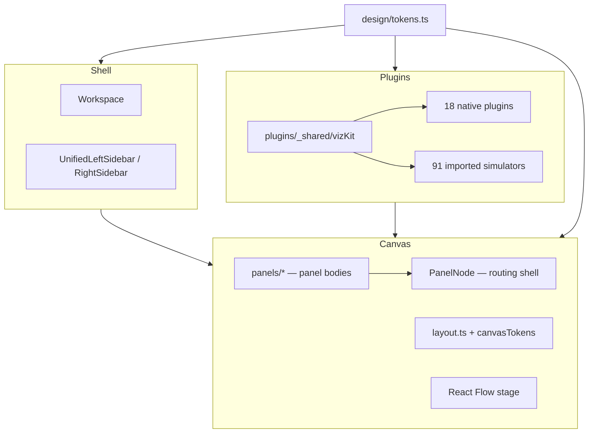

# Architecture

Three layers: **shell**, **canvas**, **plugins**.

## Shell (`src/shell/`)

App chrome: navigation, catalog, transport, density presets. Typography uses `--fs` / `--fs-sm` via `chromeUi.tsx`.

## Canvas (`src/shell/canvas/`)

React Flow workspace. `PanelNode.tsx` is a thin router; panel content lives in `panels/`. Layout presets and wire gaps come from `canvasTokens.ts`. Node sizing from `nodeTokens.ts` (`STRUDEL_NODE_W = 400`).

## Plugins (`src/plugins/`)

Each algorithm exposes `record`, `View`, `Inspector` via `definePlugin` or imported simulators. Shared viz primitives in `_shared/vizKit.tsx`; teaching panels in `_shared/practice.tsx`.

## Generated files

Do not hand-edit: `manifest.ts`, `migrated.ts`, `themes/index.css` — change generators in `scripts/` instead.
