# Frontend Architecture

> **Algo Moves** — React 18 + TypeScript 5 + Vite 8 SPA with strict layer boundaries, a plugin-driven algorithm engine, and a token-driven design system.

**Contents:** [System Overview](#system-overview) · [Layer Dependency Graph](#layer-dependency-graph) · [Route Map](#route-map) · [Plugin System](#plugin-system) · [State Management](#state-management) · [Data Flow](#data-flow) · [Design System](#design-system) · [Generated Artifacts](#generated-artifacts) · [Quality Guardrails](#quality-guardrails)

---

## System Overview

The frontend is one of four deployed services. It talks to the Go game server for arcade rooms and REST APIs, and to Hocuspocus for collaborative canvas editing.

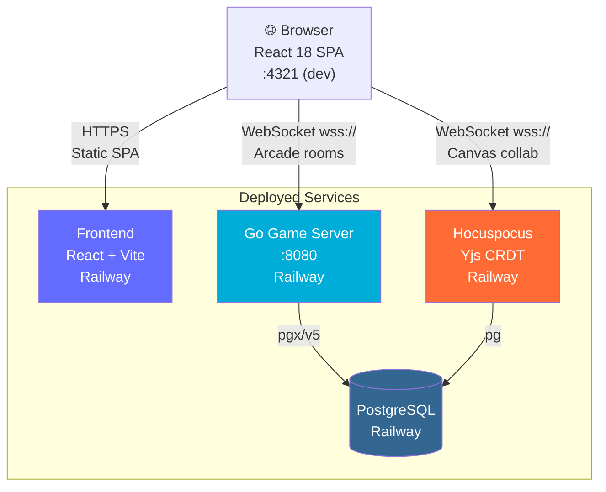

**Environment variables injected at build time:**

| Variable | Purpose |
|----------|---------|
| `VITE_API_SERVER_URL` | Go backend base URL (`https://...railway.app`) |
| `VITE_HOCUSPOCUS_URL` | Hocuspocus WebSocket URL (`wss://...railway.app`) |

---

## Layer Dependency Graph

The SPA is organized into **10 strict layers**. Imports flow **downward only** — no circular deps, no upward imports. Enforced by `check-boundaries.mjs` and `eslint-plugin-boundaries`.

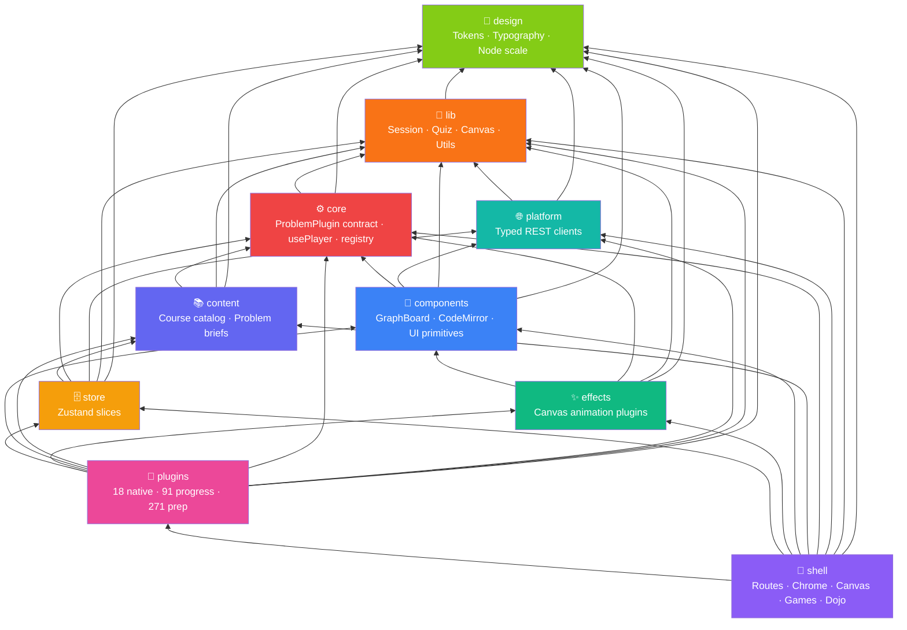

**Forbidden upward imports** (enforced at lint time):

| Source | Must not import |
|--------|-----------------|
| `design` | lib, core, content, components, effects, platform, store, plugins, shell |
| `lib` | platform, store, plugins, shell |
| `platform` | store, plugins, shell |
| `core` | store, plugins, shell |
| `content` | store, plugins, shell |
| `components` | store, plugins, shell |
| `effects` | store, plugins, shell |
| `store` | plugins, shell |
| `plugins` | shell |

> Composition roots (`core/registry.ts`, `content/index.ts`) may import plugins by design and are explicitly whitelisted.

---

## Route Map

The app uses a **hash-based workspace store** — there is no Next.js router and no `pages/` folder. `App.tsx` reads `useWorkspace().route` to mount the correct shell.

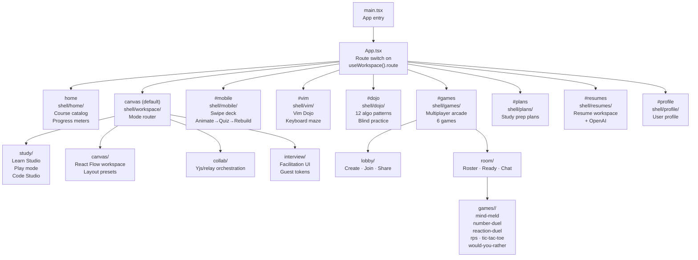

---

## Plugin System

The engine is **algorithm-agnostic** — it steps an array of `Frame`s and asks the plugin's `View` to render the current one. The shell knows nothing about any specific algorithm.

### Plugin Contract

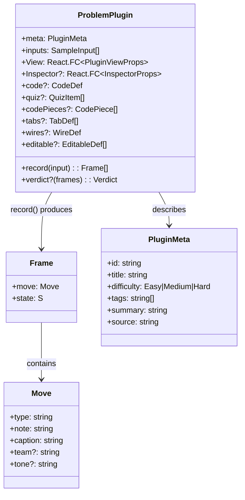

### Plugin Hierarchy

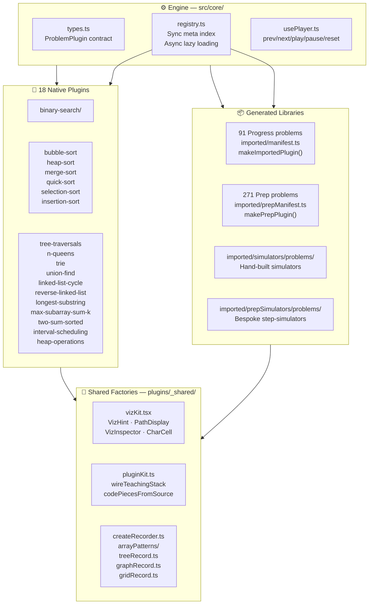

### Plugin Data Flow

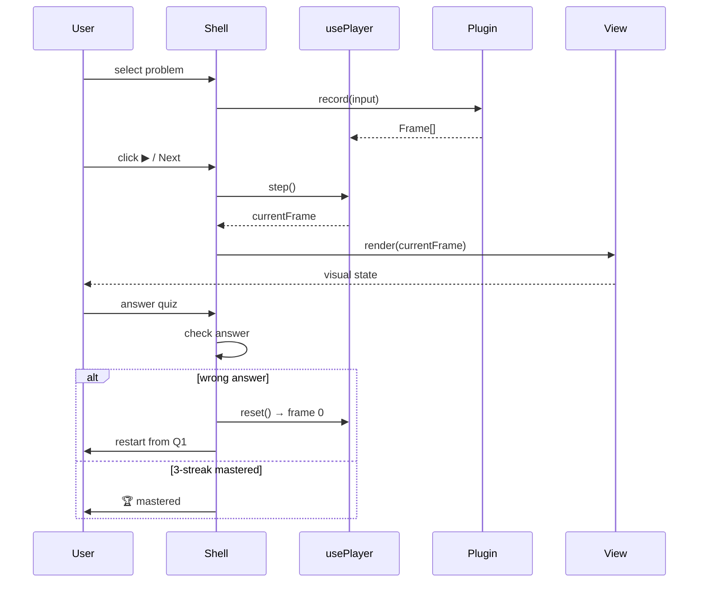

---

## State Management

Zustand slices are organized by domain. Each slice lives in `store/<domain>/`.

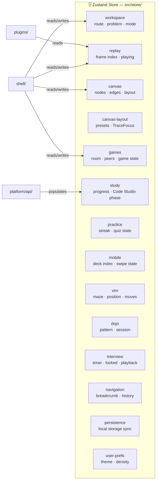

---

## Data Flow

### Solo Learning Session

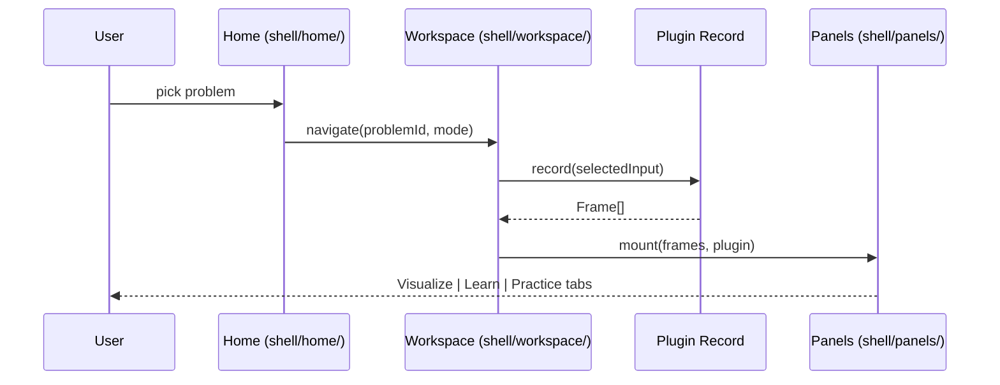

### Multiplayer Games Session

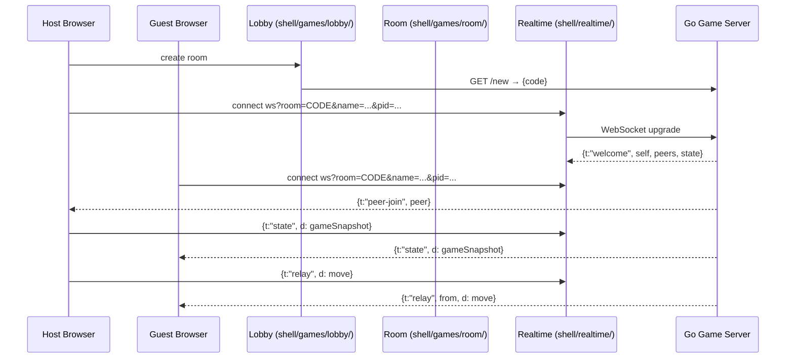

### Collaborative Canvas Session

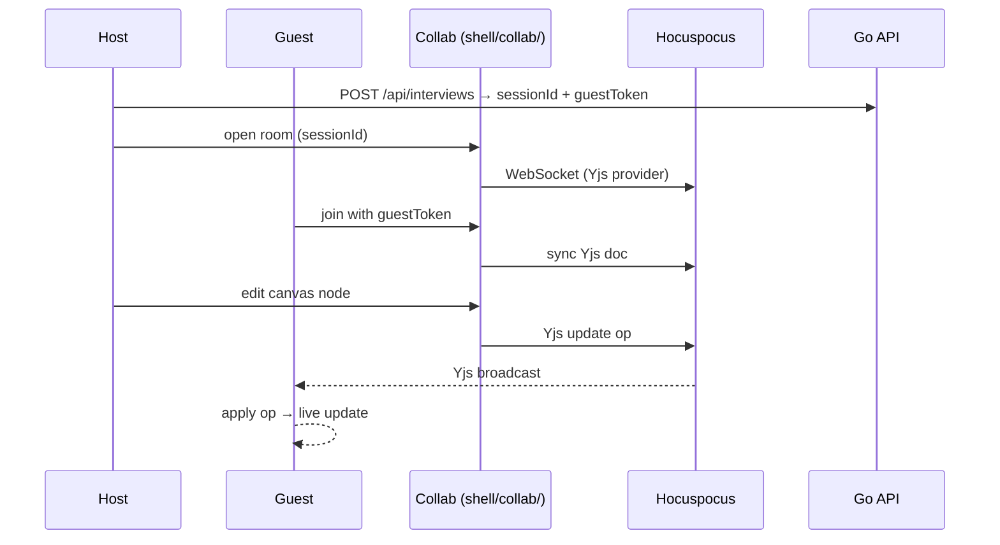

---

## Design System

All visual values flow from a single source of truth: `src/design/tokens.ts`.

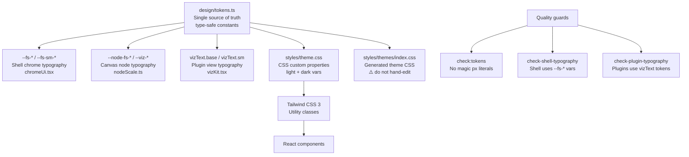

**Three typography layers — never mix:**

| Layer | Token source | Used by |
|-------|-------------|---------|
| Shell chrome | `--fs-*`, `--fs-sm-*` | `shell/`, `components/` |
| Canvas nodes | `--node-fs-*`, `--viz-*` | Plugin `View`s inside `.algo-canvas` |
| Viz primitives | `vizText.base`, `vizText.sm` | `_shared/vizKit.tsx` exports |

---

## Generated Artifacts

Several files are **generated outputs** — never hand-edit them. Change the upstream data or generator, then regenerate.

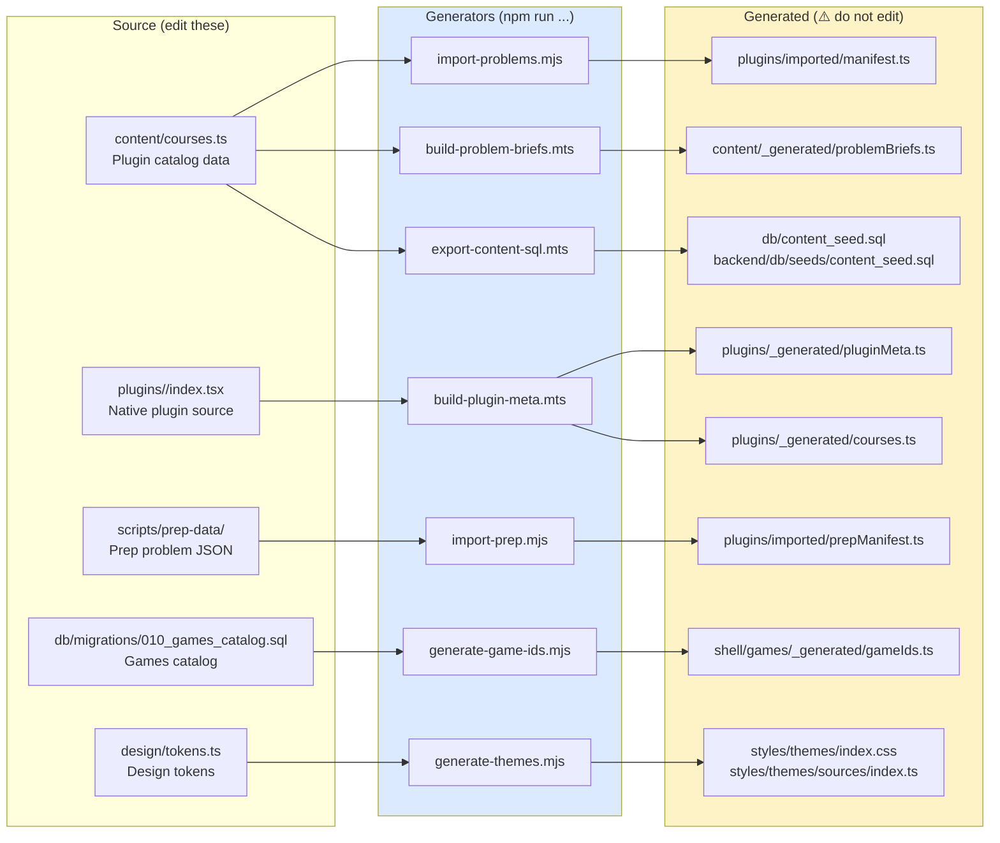

---

## Quality Guardrails

All guards run via `npm run check:all` (also enforced in CI):

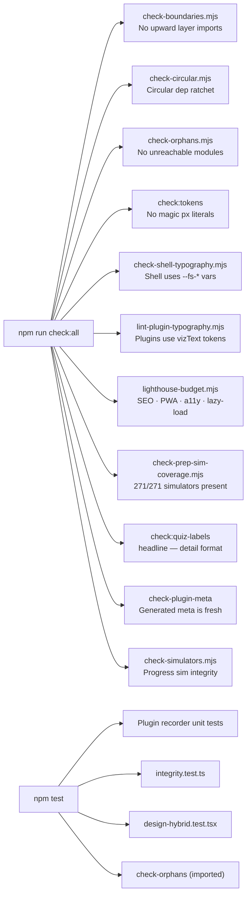

---

## Folder Reference

```
frontend/src/
├── main.tsx                    App entry
├── App.tsx                     Route switch (useWorkspace().route)
│
├── core/                       Plugin-agnostic engine
│   ├── types.ts                ProblemPlugin / Frame / Move contracts
│   ├── registry.ts             Sync meta index + async per-group lazy loading
│   └── usePlayer.ts            step / play / pause / reset
│
├── design/                     🎨 Token system (see design/README.md)
│   ├── tokens.ts               Single source of truth
│   ├── typography.ts           Shell chrome font helpers
│   ├── nodeScale.ts            Canvas node scale helpers
│   └── canvasMetrics.ts        Canvas layout constants
│
├── lib/                        🔧 Pure utilities
│   ├── session/                Session kinds (solo / collab / interview)
│   ├── quiz/                   Quiz logic + scoring
│   ├── canvas/                 Canvas helpers
│   ├── code/                   Code utilities
│   └── utils/                  General helpers
│
├── platform/                   🌐 Backend REST clients
│   └── api/
│       ├── authApi.ts          /api/auth/*
│       ├── contentApi.ts       /api/content/*
│       ├── gamesApi.ts         /api/games/*
│       ├── interviewApi.ts     /api/interviews/*
│       ├── canvasApi.ts        /api/canvases/*
│       ├── prepApi.ts          /api/prep-plans/*
│       └── resumeApi.ts        /api/resumes/*
│
├── content/                    📚 Course catalog
│   ├── courses.ts              Canonical catalog (source for generated files)
│   ├── taxonomy.ts             Tags + difficulty taxonomy
│   ├── navigation/             Sidebar navigation tree
│   └── _generated/
│       └── problemBriefs.ts    ⚠️ Generated — do not edit
│
├── components/                 🧩 Reusable UI
│   ├── board/                  GraphBoard, grid visualizers
│   ├── code/                   CodeMirror wrappers
│   ├── puzzle/                 Code Studio assemble/recall
│   ├── chat/                   Chat UI primitives
│   ├── shared/                 QuizChoiceLabel, cross-cutting
│   └── ui/                     Low-level UI atoms
│
├── store/                      🗄️ Zustand slices (by domain)
│
├── effects/                    ✨ Canvas animation effect plugins
│
├── hooks/                      App-wide React hooks
│
├── plugins/                    🔌 Algorithm plugins
│   ├── index.ts                Plugin manifest / registry
│   ├── _shared/                Shared factories + viz primitives
│   ├── _generated/             ⚠️ Generated metadata
│   ├── binary-search/          ) 18 curated native plugins
│   ├── ...other natives/       )
│   └── imported/               Generated reference libraries
│       ├── factory.tsx         makeImportedPlugin
│       ├── prepFactory.tsx     makePrepPlugin
│       ├── manifest.ts         ⚠️ Generated — 91 progress problems
│       ├── prepManifest.ts     ⚠️ Generated — 271 prep problems
│       ├── simulators/         Hand-built progress simulators
│       └── prepSimulators/     Bespoke prep step-simulators
│
├── shell/                      🐚 All routes + app chrome
│   ├── home/                   Course catalog + landing
│   ├── workspace/              Algorithm workspace mode router
│   ├── study/                  Learn Studio · Play · Code Studio
│   ├── canvas/                 React Flow workspace
│   ├── collab/                 Yjs + relay collaboration transport
│   ├── interview/              Interview facilitation UI
│   ├── panels/                 Shared panel bodies (visualize/practice/code)
│   ├── realtime/               WebSocket room transport
│   ├── mobile/                 Swipe deck (animate → quiz → rebuild)
│   ├── vim/                    Vim Dojo keyboard maze puzzles
│   ├── dojo/                   Practice dojo (12 algo pattern modules)
│   ├── games/                  Multiplayer arcade
│   │   ├── arcade/             Route chrome + profile overlay
│   │   ├── lobby/              Create / join / share flow
│   │   ├── room/               Roster · chooser · ready · chat
│   │   ├── games/<id>/         Per-game UI + logic.ts
│   │   ├── ui/                 Arcade-only primitives
│   │   ├── net/                Room transport hooks
│   │   ├── engine/             Game engine abstractions
│   │   └── _generated/
│   │       └── gameIds.ts      ⚠️ Generated from DB migration 010
│   ├── browse/                 Content browsing
│   ├── plans/                  Study prep plans
│   ├── resumes/                Resume workspace + OpenAI customization
│   ├── profile/                User profile
│   ├── settings/               User settings sync
│   ├── auth/                   AuthProvider · login · signup
│   └── chrome/                 Navigation + app chrome
│
└── styles/
    ├── theme.css               CSS custom properties (light + dark)
    └── themes/
        └── index.css           ⚠️ Generated theme CSS
```

---

## Related Documentation

| Doc | Description |
|-----|-------------|
| [Backend Architecture](ARCHITECTURE-BACKEND.md) | Go service architecture, WebSocket protocol, domain packages |
| [Architecture Overview](architecture.md) | Combined system overview with session model |
| [Plugin Authoring](../frontend/src/plugins/README.md) | ProblemPlugin contract, vizKit, teaching stack |
| [Plugin Example](../frontend/src/plugins/EXAMPLE.md) | Native + imported plugin end-to-end walkthrough |
| [Design Tokens](../frontend/src/design/README.md) | Typography and layout token hierarchy |
| [Quiz & Code Studio](quiz-and-code-studio.md) | Quiz label format, shuffle/restart, Code Studio phases |
| [Visual QA Checklist](visual-qa-checklist.md) | Release checklist for density, themes, mobile |
| [Games Arcade](../frontend/src/shell/games/README.md) | Multiplayer arcade layout and game contract |
