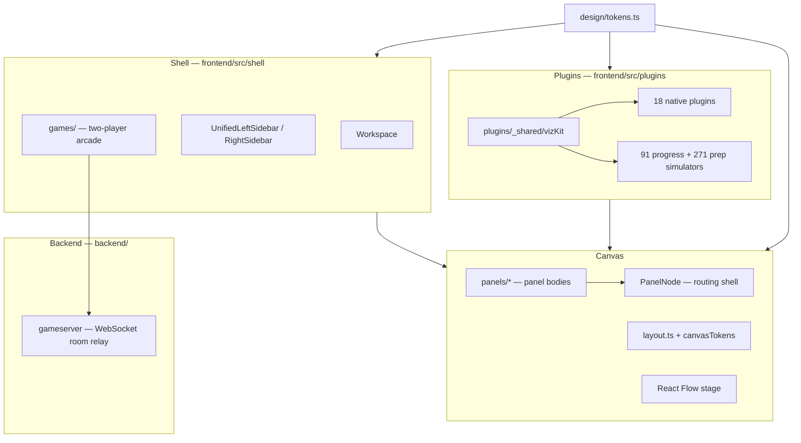

# Architecture

Three layers in the frontend SPA, plus an optional Go backend for realtime games.

## Shell (`frontend/src/shell/`)

App chrome: navigation, catalog, transport, density presets. Typography uses `--fs` / `--fs-sm` via `chromeUi.tsx`.

Routes in `App.tsx`: home, workspace canvas, mobile deck (`#mobile`), Vim Dojo (`#vim`), and the **Games arcade** (`#games`).

### Games arcade (`frontend/src/shell/games/`)

Two-player couch/long-distance games over WebSocket:

- `net/` — `useGameRoom` hook, protocol types, server URL resolution
- `lobby/` — create/join room, share code + QR
- `games/<id>/` — individual game plugins (Tic-Tac-Toe, Number Duel, …)

Room codes are minted by the Go server (`GET /new`). The host picks the shared game; relay messages carry per-game moves.

## Backend (`backend/`)

Stdlib-only Go service: pairs two players into a room, relays JSON, stores host shared state. See [`backend/README.md`](../backend/README.md).

Deploy both apps on Railway with GitHub connected per service (`backend/` and `frontend/` root directories, branch `main`). The frontend build injects `VITE_GAMES_SERVER_URL` from Railway service variables so browsers reach the game server.

## Canvas (`frontend/src/shell/canvas/`)

React Flow workspace. `PanelNode.tsx` is a thin router; panel content lives in `panels/`. Layout presets and wire gaps come from `canvasTokens.ts`. Node sizing from `nodeTokens.ts` (`STRUDEL_NODE_W = 400`).

## Plugins (`frontend/src/plugins/`)

Each algorithm exposes `record`, `View`, `Inspector` via `definePlugin` or imported simulators. Shared viz primitives in `_shared/vizKit.tsx`; teaching panels in `_shared/practice.tsx`.

Prep library (271 problems) and progress library (91 problems) are generated into `imported/prepManifest.ts` and `imported/manifest.ts`.

## Generated files

Do not hand-edit: `manifest.ts`, `migrated.ts`, `themes/index.css` — change generators in `frontend/scripts/` instead.
