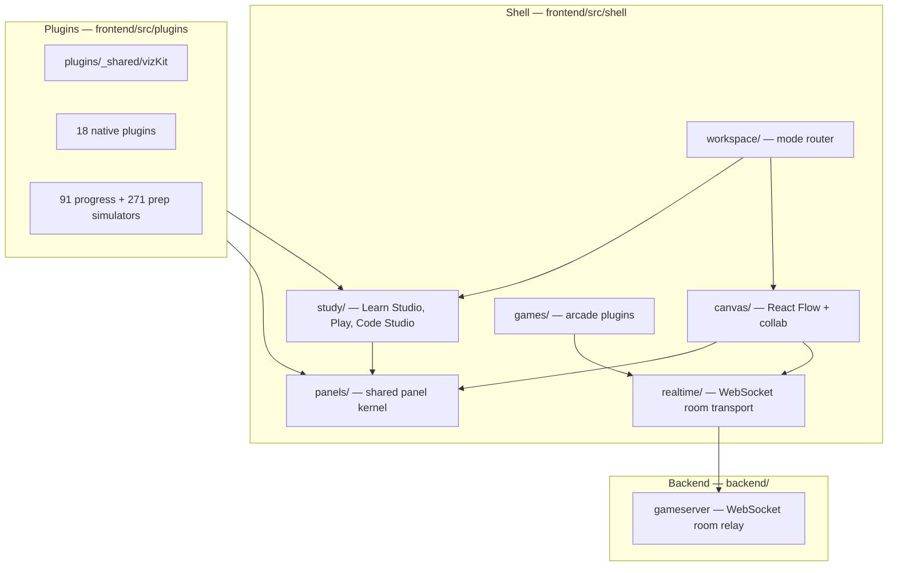

# Architecture

Three layers in the frontend SPA, plus an optional Go backend for realtime games.

## Product domains

| Domain | Path | Purpose |
|--------|------|---------|
| **Study** | `shell/study/` | Solo learning: Learn Studio, Play mode, Code Studio quiz/recall |
| **Canvas** | `shell/canvas/` | Freeform React Flow workspace, layout, collaboration overlays |
| **Panels** | `shell/panels/` | Shared panel bodies used by both Study and Canvas |
| **Realtime** | `shell/realtime/` | WebSocket room transport (games + canvas collab) |
| **Session** | `lib/session/` | Session kinds: solo, collab, interview |

### Session model

- **solo** — default; Learn / Play / Mobile
- **collab** — freeform canvas with generic host/guest roles
- **interview** — host shares a problem; candidate works; quiz answers relay to host (scaffold)

Room shared state uses a v1 envelope (`shell/realtime/roomState.ts`) with `session` + `canvas` fields.

## Shell (`frontend/src/shell/`)

App chrome: navigation, catalog, transport, density presets. Typography uses `--fs` / `--fs-sm` via `chromeUi.tsx`.

Routes in `App.tsx`: home, workspace, mobile deck (`#mobile`), Vim Dojo (`#vim`), and the **Games arcade** (`#games`).

### Games arcade (`frontend/src/shell/games/`)

Multiplayer games over WebSocket. Transport lives in `shell/realtime/`; game plugins stay under `games/<id>/`.

### Study store facade (`store/study/`)

Thin re-exports over progress, Code Studio phase persistence, and resume helpers — prep for future server sync.

## Backend (`backend/`)

Stdlib-only Go service: pairs players into a room, relays JSON, stores host shared state. See [`backend/README.md`](../backend/README.md).

Deploy both apps on Railway with GitHub connected per service (`backend/` and `frontend/` root directories, branch `main`). The frontend build injects `VITE_GAMES_SERVER_URL` from Railway service variables so browsers reach the game server.

## Canvas (`frontend/src/shell/canvas/`)

React Flow workspace. `PanelNode.tsx` routes to bodies in `shell/panels/`. Layout presets include **TraceFocus** (formerly "Study").

## Plugins (`frontend/src/plugins/`)

Each algorithm exposes `record`, `View`, `Inspector` via `definePlugin` or imported simulators. Shared viz primitives in `_shared/vizKit.tsx`; teaching panels in `_shared/practice.tsx`.

Prep library (271 problems) and progress library (91 problems) are generated into `imported/prepManifest.ts` and `imported/manifest.ts`.

## Generated files

Do not hand-edit: `manifest.ts`, `migrated.ts`, `themes/index.css` — change generators in `frontend/scripts/` instead.
