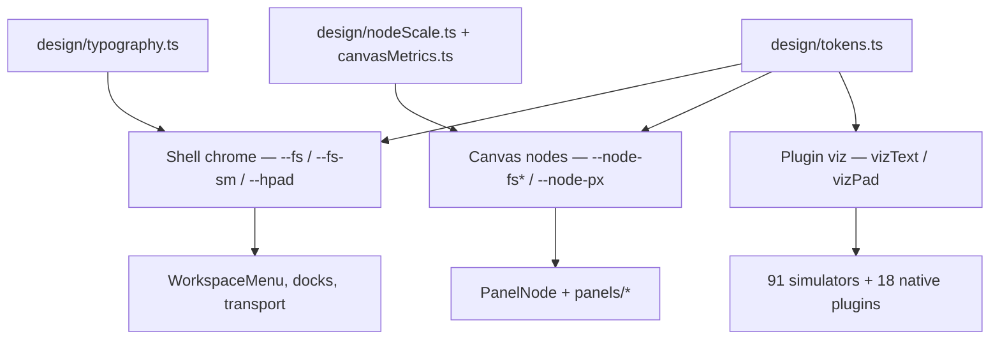

# Design tokens

Token hierarchy for algo-moves — one scale per surface layer.



## Rules

1. **One horizontal inset per surface** — `--hpad` for shell chrome, `--node-px` for canvas nodes and viz boards.
2. **One type scale per layer** — `chromeText` / `--fs*` (shell), `nodeText` / `--node-fs*` (canvas), `vizText` (plugins).
3. **No magic layout numbers** — import node width, canvas margin, viewport, and fit timing tokens from `design/tokens.ts`, `design/nodeScale.ts`, `design/canvasMetrics.ts`, or their canvas barrels.
4. **Plugins use vizKit** — `VizInspector`, `InspectorRow`, `PathDisplay`, etc. Never hardcode `text-[13px]` in `src/plugins/`.
5. **Generated theme artifacts are downstream** — edit `scripts/generate-themes.mjs` or raw theme inputs, not `styles/themes/index.css` or `styles/themes/sources/index.ts`.
6. **Shared UI belongs in design/components** — reusable chips, meters, pills, labels, avatars, and empty states must not be imported from canvas internals.

## Usage

```typescript
import { spacing, vizText } from '../design/tokens';
import { NODE_MIN_W, clampNodeWidth } from '../design/nodeScale';
import { Chip, Meter, Pill } from '@/design/components';
import { VizInspector, InspectorRow } from '../plugins/_shared/vizKit';
```

Run guards: `npm run check:tokens`, `npm run check-shell-typography`, `npm run check-plugin-typography`, `npm run check-simulators`, `npm run check:lighthouse-budget`.
