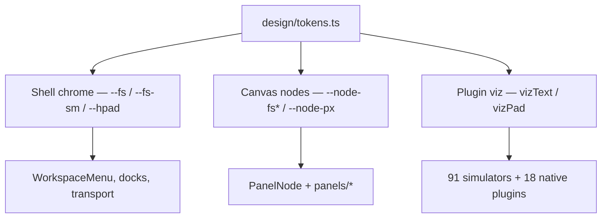

# Design tokens

Token hierarchy for algo-moves — one scale per surface layer.



## Rules

1. **One horizontal inset per surface** — `--hpad` for shell chrome, `--node-px` for canvas nodes and viz boards.
2. **One type scale per layer** — `chromeText` / `--fs*` (shell), `nodeText` / `--node-fs*` (canvas), `vizText` (plugins).
3. **No magic layout numbers** — import `STRUDEL_NODE_W`, `MIN_VIEWPORT_HEIGHT`, `FIT_VIEW_DURATION_MS` from `design/tokens.ts` or `canvasTokens.ts`.
4. **Plugins use vizKit** — `VizInspector`, `InspectorRow`, `PathDisplay`, etc. Never hardcode `text-[13px]` in `src/plugins/`.

## Usage

```typescript
import { STRUDEL_NODE_W, spacing, vizText } from '../design/tokens';
import { nodeText } from '../shell/canvas/nodeui';
import { VizInspector, InspectorRow } from '../plugins/_shared/vizKit';
```

Run guards: `npm run check:tokens`, `npm run check-plugin-typography`, `npm run check-simulators`.
